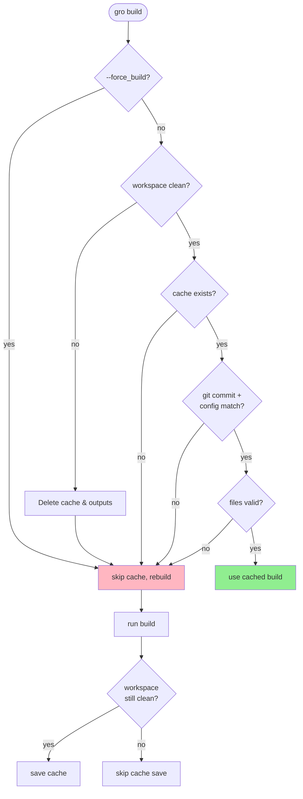

# build

> these docs are for production builds, for development see [dev.md](dev.md)

## usage

The `gro build` task produces outputs for production:

```bash
gro build
```

This runs the configured Gro plugins, `setup -> adapt -> teardown`, in production mode.

If your project has a SvelteKit frontend,
[the default plugin](../lib/gro_plugin_sveltekit_app.ts) calls `vite build`,
forwarding any [`-- vite [...]` args](https://vitejs.dev/config/):

```bash
gro build -- vite --config my-config.js
```

## build caching

Gro caches builds to skip expensive rebuilds when nothing has changed.

The cache key has two components:

- git commit hash - tracks code, dependencies, and config files
- `build_cache_config` hash - optional, for tracking external inputs like environment variables or feature flags
  (see [config.md](config.md#build_cache_config))

The cache invalidates when either component changes.

When the cache is valid:

```bash
gro build
# Build cache valid (from 2025-10-21T10:30:00.000Z) (use --force_build to rebuild)
# Skipping build, cache is valid
```

Force a rebuild:

```bash
gro build --force_build
```

### how caching works



### cache storage

Cache metadata is stored at `.gro/build.json`.
This location is independent of build outputs, so the cache survives manual deletion of `build/`.
Running `gro clean` deletes the cache along with the `.gro/` directory.

### dirty workspace behavior

The build cache only works with a clean git workspace.
With uncommitted changes, the git commit hash doesn't reflect your actual code state,
so Gro disables caching to ensure builds always match your working directory.

This conservative approach prevents a subtle issue:
uncommitted changes could be reverted after building,
leaving cached outputs from code that no longer exists in your workspace.

Behavior with uncommitted changes:

- cache checking is skipped - builds always run
- cache is not saved - no `.gro/build.json` written
- all build outputs are deleted - `build/`, `dist/`, and `dist_*/` removed to prevent stale state
- you'll see: `workspace has uncommitted changes - skipping build cache`

### custom cache invalidation

If your build depends on external factors (environment variables, data files, feature flags),
use `build_cache_config` in `gro.config.ts` to invalidate the cache when they change:

```typescript
// gro.config.ts
export default {
	build_cache_config: {
		api_endpoint: process.env.PUBLIC_API_URL,
		data_version: fs.readFileSync('data/version.txt', 'utf-8'),
		features: {analytics: true, beta_ui: false},
	},
} satisfies Gro_Config;
```

The config is hashed (never logged) to protect sensitive values. Any change triggers a rebuild.

See [config.md](config.md#build_cache_config) for more details on `build_cache_config`.

### cache validation

Beyond checking the cache key, Gro validates that cached output files haven't been tampered with or corrupted.
All output files are hashed in parallel to verify integrity.
This is a robustness design choice - even if the cache key matches,
corrupted or manually modified files trigger a rebuild.

The hashing is usually fast but adds overhead proportional to output size.

Force a rebuild without validation:

```bash
gro build --force_build
```

### output file discovery

The build cache automatically discovers and validates all output files:

- **regular files** - hashed with SHA-256 and validated on cache checks
- **symlinks** - skipped (not hashed or tracked)
- **directories** - recursively scanned for regular files

This ensures cache validation is comprehensive while avoiding issues with symlink handling across platforms.

### troubleshooting

Cache not working as expected?

- **workspace must be clean** - check `git status`
- **enable debug logging** - `LOG_LEVEL=debug gro build`
- **corrupted cache** - delete `.gro/build.json` and rebuild
- **platform differences** - add platform/arch to `build_cache_config`
- **non-deterministic builds** - builds with timestamps/UUIDs/random data invalidate cache every run
  - diagnostic: if cache never hits, run `gro build` twice and compare outputs:
    ```bash
    gro build && cp -r build build_1
    gro build && diff -r build build_1
    ```
  - if files differ, your build is non-deterministic
  - common causes: `new Date()`, `Math.random()`, `process.pid` in build-time code
  - solution: use `import.meta.env.MODE` checks or build-time constants

> ⚠️ the cache is conservative - when in doubt, it rebuilds

For implementation details, see [build cache internals](#build-cache-internals).

### race condition protection

After a successful build, Gro verifies the git commit hash hasn't changed before saving the cache.
If the commit changed during the build (e.g., you committed while building),
the cache is not saved and you'll see a warning.
This ensures cache metadata always matches its corresponding build outputs.

### best practices

For reliable caching:

- commit before building for production - cache requires a clean workspace
- use `build_cache_config` for external inputs - environment variables,
  remote configs, or feature flags that affect the build but aren't in git
- use `gro check --workspace` in CI - enforces clean git state before building
- avoid concurrent builds - multiple simultaneous `gro build` processes can conflict

During development, uncommitted changes automatically disable caching,
so builds always reflect your working directory.

### CI/CD integration

> Don't commit `.gro/build.json` - keep it in `.gitignore`.

Caching `.gro/` between CI runs is usually not beneficial since each commit invalidates the cache.

Basic CI workflow:

```bash
gro check --workspace  # ensure clean workspace
gro build              # build (uses cache if valid)
```

To investigate cache issues, use `LOG_LEVEL=debug gro build` or `gro build --force_build`.

## plugins

`Plugin`s are objects that customize the behavior of `gro build` and `gro dev`.
They try to defer to underlying tools as much as possible, and exist to glue everything together.
For example, the library plugin internally uses
[`svelte-package`](https://kit.svelte.dev/docs/packaging).
See [plugin.md](plugin.md) to learn more.

## deploying and publishing

Now that we can produce builds, how do we share them with the world?

The [`gro deploy`](deploy.md) task outputs builds to a branch,
like for static publishing to GitHub pages.

The [`gro publish`](publish.md) task publishes packages to npm.

Both of these tasks call `gro build` internally,
and you can always run it manually if you're curious.

## build cache internals

> implementation details for advanced debugging

The build cache ([`src/lib/build_cache.ts`](../lib/build_cache.ts)) validates builds are current
by tracking git commits and optional user config.

### cache metadata structure

`.gro/build.json` stores:

```json
{
	"version": "1", // schema version
	"git_commit": "abc123...", // commit at build time
	"build_cache_config_hash": "...", // SHA-256 of user config
	"timestamp": "ISO-8601", // build completion time
	"outputs": [
		// all output files with hashes and stats
		{
			"path": "build/index.html",
			"hash": "...", // SHA-256 of file contents
			"size": 1024, // file size in bytes
			"mtime": 1729512000000, // modification time (ms since epoch)
			"ctime": 1729512000000, // change/creation time (ms since epoch)
			"mode": 33188 // Unix file permissions (0644)
		},
		{
			"path": "dist/index.js",
			"hash": "...",
			"size": 2048,
			"mtime": 1729512001000,
			"ctime": 1729512001000,
			"mode": 33188 // stored but not validated
		}
	]
}
```

### validation flow

1. load `.gro/build.json` - missing/corrupt = rebuild
2. check version = "1" - mismatch = rebuild
3. compare git commit - different = rebuild
4. compare config hash - different = rebuild
5. verify files exist - missing = rebuild
6. check file sizes - mismatch = rebuild (fast path optimization)
7. hash files in parallel - mismatch = rebuild
8. all pass = use cache

### security

The cache uses SHA-256 cryptographic hashing for:

- output file integrity: detects tampering or corruption
- config protection: `build_cache_config` is hashed, never logged raw (may contain secrets)
- cache key stability: deterministic hashes ensure consistent cache behavior

Hashes are computed via Node's `webcrypto.subtle.digest()`.

### output directory discovery

The cache automatically discovers all build output directories:

- `build/` - SvelteKit app output
- `dist/` - SvelteKit library output
- `dist_*` - plugin outputs (e.g., `dist_server`)

All regular files are hashed and validated. Symlinks are ignored (only their targets are tracked if they're build outputs).

### extending the cache

To influence the cache, plugins should contribute configuration in `gro.config.ts` before config normalization.
Since `build_cache_config` is hashed during config load, plugins running later cannot modify it.

Instead, include any plugin-specific cache factors in your `gro.config.ts`:

```ts
// gro.config.ts
export default {
	build_cache_config: {
		my_plugin_version: '1.0.0', // plugin version affects cache
		other_factor: process.env.MY_BUILD_FACTOR,
	},
};
```

See [`build.task.ts`](../lib/build.task.ts) for integration with the build pipeline.
